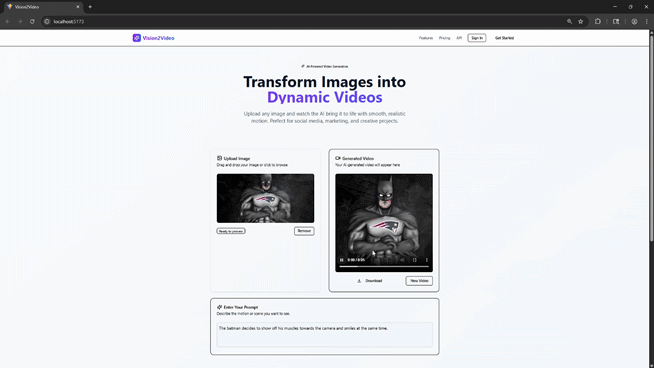

# Vision 2 Video ✨


Transform any static image into a short, dynamic video using the power of AI. This full-stack application provides a seamless user experience for bringing photos to life.

### 📸 App Preview



### 💡 The Tech Stack Explained

This project is a modern full-stack application, carefully designed for performance, user experience, and scalability.

#### Frontend (The User's Experience)

*   **React & Vite:** The UI is built with React, the industry standard for creating dynamic and interactive user interfaces. Using Vite as a build tool for its blazing-fast development server and it optimizes production builds.
*   **Tailwind CSS & shadcn/ui:** The beautiful, responsive design is crafted with Tailwind CSS, a utility-first framework that allows for rapid styling. All components (buttons, cards, etc.) are implemented using `shadcn/ui`, providing accessible and composable building blocks for a professional look and feel.
*   **Asynchronous Polling:** The frontend doesn't freeze while the video is generating. It submits a job which it gets a `job_id`, and then polls a status endpoint every few seconds. This provides a non-blocking, responsive experience for the user and completes it with a real-time progress bar.

#### Backend (The AI Brain)

*   **Python & FastAPI:** The backend is powered by Python, the premier language for machine learning. Using FastAPI, a high-performance web framework to build the API. FastAPI's key features include automatic interactive documentation, data validation with Pydantic, and native support for asynchronous tasks.
*   **Stable Video Diffusion:** The core AI magic comes from `stabilityai/stable-video-diffusion-img2vid-xt`, a state-of-the-art generative model. This model takes a source image and synthesizes a sequence of frames to create a plausible short video.
*   **Background Tasks:** Video generation is slow. To prevent user requests from timing out, our API leverages FastAPI's `BackgroundTasks`. When a request comes in, the heavy AI work is immediately handed off to a background process, allowing the server to instantly respond to the user with a `job_id`.

---

### 🔧 Running the Project Locally

To run this project on your own machine, follow these steps:

1.  **Clone the repository:**
    ```bash
    git clone https://github.com/acarrra61/vision2video.git
    cd vision2video
    ```

2.  **Set up the Backend:**
    ```bash
    # Create and activate a Python virtual environment
    python -m venv venv
    source venv/Scripts/activate # If using Windows: venv\Scripts\activate
    

    # Install Python dependencies
    pip install -r requirements.txt

    # Start the backend server
    uvicorn main:app --reload
    ```
    The backend will be running at `http://localhost:8000`.

3.  **Set up the Frontend:**
    ```bash
    # Open a new terminal window
    cd frontend

    # Install Node.js dependencies
    npm install

    # Start the frontend development server
    npm run dev
    ```
    The frontend will be running at `http://localhost:5173`.

---

*This project was built by Abel Carrasco for the Boot.dev Hackathon! July 2025.*
